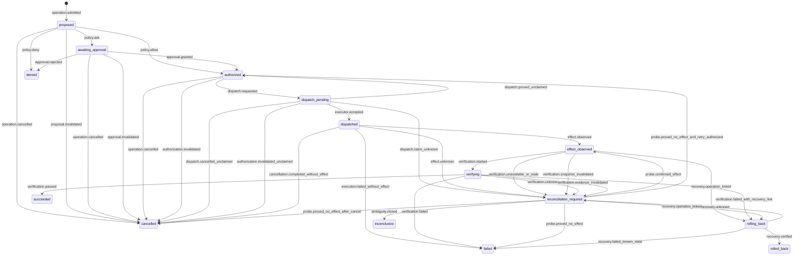
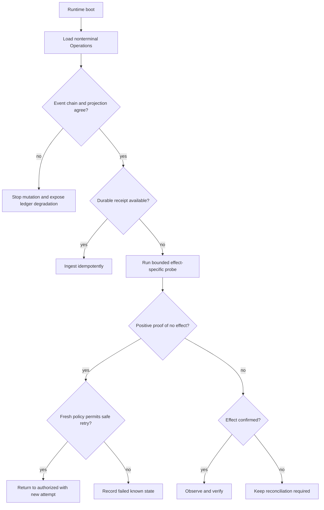

# ADR-0002: Define the durable Operation ledger and state machine

- Status: Accepted
- Date: 2026-07-16
- Accepted at: 2026-07-17T00:26:35Z
- Accepted by: Astra product owner, Emanuele Denaro
- Approved decision SHA-256: `8bdf77cda335fa64fb592b7a9785a109f318fad2729e785ffb72794bd24bf028`
- Task: ASTRA-0002
- Governing Task Doc: `../coordination/tasks/ASTRA-0002-operation-ledger-state-machine.md`
- Decision owners: Astra product owner, architecture owner, ledger and recovery owner, security owner
- Evidence baseline: `anomalyco/opencode` `dev` at `453b61e27b2f6c2752a60dd7d8412bdcf4e0aa3d`
- Depends on: ADR-0001
- Supersedes: None
- Superseded by: None

## Context

Astra promises that the programmer can always distinguish intent, authority, execution, observed effects, verification, uncertainty, and recovery. The current blueprint describes those concepts with two useful but different vocabularies:

- the engineering contract uses evidence-oriented states such as `Proposed`, `Authorized`, `Dispatched`, `Effected`, `Succeeded`, and `Inconclusive`;
- the architecture diagrams use orchestration and presentation terms such as `Admitted`, `Planned`, `Ready`, `Running`, `EffectObserved`, `Blocked`, and `ReconciliationRequired`.

Implementing both vocabularies as domain state would create two sources of truth. It would let a UI or compatibility runtime claim that work is finished while the durable ledger still lacks evidence.

OpenCode already provides valuable primitives at the audited baseline:

- durable aggregate events with monotonic sequence numbers;
- event and local projector work committed in one SQLite transaction;
- replay, bounded aggregate reads, subscriptions, ownership claims, and divergence checks;
- durable Session records, permission events, snapshots, conditional file writes, tool settlement, and process-local execution coordination.

Those primitives are not yet an Astra Operation ledger. Current Session execution ownership is process-local. Permission decisions are not bounded capability grants. A tool result or process exit does not prove the external state. Current Session events do not carry the complete Operation identity, baseline, attempt, policy, capability, receipt, verification, rollback, or reconciliation contract.

## Decision

Astra will implement exactly one canonical, unversioned `Operation` aggregate owned by `astra-domain` and one append-only Operation ledger owned by `astra-ledger`.

The canonical durable states are:

```text
proposed
awaiting_approval
authorized
dispatch_pending
dispatched
effect_observed
verifying
reconciliation_required
rolling_back
succeeded
denied
cancelled
failed
rolled_back
inconclusive
```

The first nine are active states. The final six are terminal states. `reconciliation_required` remains active while a bounded probe or explicit owner decision can still resolve the result. `inconclusive` is terminal and preserves uncertainty when no safe automatic resolution remains or the authorized owner closes the Operation without asserting an effect.

`Admitted` is the durable event that creates `proposed`. `Planned` is immutable proposal data. `Ready`, `Running`, `Effected`, and `Blocked` are presentation terms derived from the canonical state. They are not additional domain states. `Finished` is never a domain state or a verification verdict.

Every protocol and UI projection carries the exact `canonical_state` plus one deterministic semantic key from this total mapping:

| Canonical state | Projection semantic key | Required user-visible meaning |
| --- | --- | --- |
| `proposed` | `PLANNING` | Intent and verification criteria exist; no authority exists |
| `awaiting_approval` | `AWAITING_APPROVAL` | An exact immutable preview awaits an authorized decision |
| `authorized` | `READY` | One bounded attempt is authorized but not requested for dispatch |
| `dispatch_pending` | `DISPATCHING` | A durable request exists; executor acceptance is not yet proven |
| `dispatched` | `RUNNING` | The executor accepted one attempt; no effect or success is implied |
| `effect_observed` | `EFFECT_OBSERVED` | A receipt exists; independent verification is still required |
| `verifying` | `VERIFYING` | Snapshot-bound success criteria are being checked |
| `reconciliation_required` | `RECONCILIATION_REQUIRED` | The real effect is uncertain; retry and success are blocked |
| `rolling_back` | `RECOVERING` | A separately authorized compensating Operation is being reconciled |
| `succeeded` | `VERIFIED` | Independent evidence proves every success criterion |
| `denied` | `DENIED` | Authority was refused before dispatch |
| `cancelled` | `CANCELLED` | Dispatch did not occur, or a no-effect cancellation was proven |
| `failed` | `FAILED` | A known non-success state and safe next action are recorded |
| `rolled_back` | `ROLLED_BACK` | The compensating Operation restored and verified the expected state |
| `inconclusive` | `INCONCLUSIVE` | Ambiguity remains and the Operation closed without a false verdict |

ADR-0009 may choose wording, color, animation, grouping, and accessible layout for these keys, but it cannot change this mapping, hide `canonical_state`, merge uncertainty into failure, or render any state other than `succeeded` as `VERIFIED`. The informal terms `Ready`, `Running`, `Effected`, and `Blocked` therefore mean only the rows above; clients cannot infer their own lifecycle.



Every other transition is invalid and is rejected by `astra-domain`. An invalid transition is never ignored, coerced, or repaired by a UI reducer.

## Terminology

| Term | Meaning |
| --- | --- |
| Operation | One typed intent whose authority, attempts, observed effects, verification, and recovery share one durable identity |
| Attempt | One bounded dispatch of an Operation to one exact executor and adapter version |
| Baseline | The exact state against which policy, dispatch, and verification are evaluated |
| Policy decision | Deterministic `allow`, `ask`, or `deny` result with the matching rule and policy version |
| Capability grant | Short-lived, bounded, one-shot authority for one Operation attempt |
| Receipt | Immutable executor observation of what an attempt did or could prove it did not do |
| Evidence | Verifier-produced observation bound to an exact snapshot and verification plan |
| Verdict | Deterministic conclusion supported by evidence; never a restatement of executor output |
| Reconciliation | Read-only or separately authorized work that determines the real state after ambiguity |
| Projection | Rebuildable client view derived from canonical events; never an authority source |

## Ownership and dependency direction

| Package | Owns | Must not own |
| --- | --- | --- |
| `astra-domain` | Operation identity, intent, states, transition rules, baselines, attempts, receipt and evidence value contracts | SQLite, OpenCode runtime types, processes, Git, provider SDKs, UI state |
| `astra-ledger` | Event envelopes, append protocol, projections, checkpoints, receipt/evidence persistence, recovery queries, export integrity | Policy rules, host execution, verification conclusions |
| `astra-policy` | Policy evaluation, approval requirements, capability grants and revocation | Operation transitions after dispatch, executor results |
| `astra-control` | Orchestration of domain transitions and ports | Duplicate state rules or inferred success |
| `astra-executor` | Capability validation, attempt execution, durable receipt spool, cancellation and cleanup | Policy decisions or final verdicts |
| `astra-verify` | Verification plans, snapshot-bound evidence, verdicts and staleness | Mutation authority |
| `astra-runtime` | Concrete composition and single-writer ownership | Domain semantics |
| `astra-protocol` | Versioned transport projections and commands | A second Operation model |

Ports remain with the package that owns the contract. `astra-domain` imports only TypeScript and approved schema primitives. Current OpenCode services enter through named adapters assembled by `astra-runtime`.

## Canonical Operation aggregate

The durable aggregate contains or references all facts below. Exact schemas will be implemented from this decision; this is a semantic contract, not code to copy verbatim.

| Field | Rule |
| --- | --- |
| `operation_id` | Globally unique, immutable, and never reused |
| `admission_key` | Stable idempotency key for the same actor, typed intent, scope, and baseline |
| `session_id`, `task_id`, `location_id` | Causal product context; none replaces Operation identity |
| `actor` | Authenticated user, deterministic system component, or named agent identity |
| `intent` | Typed Operation kind and immutable normalized parameters |
| `effect_specification` | Frozen expected effect, target descriptors, partial-effect semantics, and completion criteria; this is the former `Planned` concept |
| `resources` | Canonical bounded resources; raw model text is not authority |
| `risk`, `reversibility` | Deterministically classified before authorization |
| `baseline` | Required exact snapshot or explicit non-repository baseline appropriate to the effect |
| `retry_budget` | Maximum attempts, eligible failure classes, semantic idempotency contract, and prohibition conditions fixed before policy evaluation |
| `state` | One canonical state from this ADR |
| `policy_decision` | Required before `authorized`, `denied`, or `awaiting_approval` |
| `capability_grant` | Required before dispatch and bound to one attempt |
| `attempts` | Ordered immutable attempt identities, adapter digests, idempotency keys, and outcomes |
| `receipts` | Immutable executor observations associated with an attempt |
| `verification_plan` | Immutable success criteria and planned independent probes required at admission for mutations and before dispatch for read-only verification Operations |
| `evidence` and `verdict` | Required before `succeeded`; bound to an exact snapshot |
| `recovery_operation_id` | Optional link to a separately admitted compensating Operation; the original aggregate never dispatches a second intent |
| `last_sequence` | Optimistic-concurrency boundary for the aggregate |

Secrets are never fields. Only opaque credential-handle identifiers and non-secret destination metadata may be referenced. Model output, tool output, provider output, branch names, filenames, and error text remain untrusted payload data.

### Baseline contract

A baseline is a discriminated value chosen by Operation kind, not a nullable generic hash.

| Effect class | Minimum baseline |
| --- | --- |
| Repository filesystem | Workspace identity and trust digest; canonical Location; HEAD or explicit non-Git marker; index tree; tracked worktree digest; untracked path/content digest with declared size policy; selected resource identities; relevant config, policy, adapter and tool digests |
| Git index, worktree, commit or ref | Repository/common-directory identity; HEAD and named refs; index tree; worktree/untracked digest; selected paths or commit range; worktree owner; exact Git adapter digest |
| Process or shell | Workspace and Location identity; executable and argument digest; cwd; environment-key manifest; filesystem/network/isolation profile; tool and adapter digest |
| Provider or remote API | Provider, model, organization/region, normalized destination, data classification, auth-handle identity, request semantic digest, remote precondition or explicit absence, adapter digest |
| Extension or MCP | Publisher/server/tool/version/digest, manifest, granted capabilities, isolation profile, destination and catalog digest |
| Verification | Exact subject snapshot, verification plan, verifier and adapter digests, applicable policy and toolchain manifest |

If a required component is unavailable, the Operation cannot be authorized. Current best-effort OpenCode snapshots may contribute facts but cannot satisfy the full repository baseline alone.

## State meanings and required facts

| State | Precise meaning | Minimum durable facts |
| --- | --- | --- |
| `proposed` | A complete typed plan passed schema admission; no authority or execution is implied | Operation ID, admission key, actor, intent, frozen effect specification, scope, resources, baseline, risk, reversibility, retry budget, success criteria and verification plan |
| `awaiting_approval` | Deterministic policy requires an authorized human decision | Policy decision, matching rule, immutable approval preview, expiry |
| `authorized` | Policy and any required approval granted one bounded future attempt | Decision, approver if applicable, policy version, capability grant reference |
| `dispatch_pending` | A durable dispatch request exists, but no durable executor acceptance is yet proven | Attempt ID, outbox record, executor and adapter identity/digest, reserved capability, idempotency key |
| `dispatched` | One exact executor accepted one attempt; no effect is assumed | Attempt ID, executor and adapter identity/digest, idempotency key, capability consumption, dispatch record |
| `effect_observed` | The executor recorded an effect or a verified no-op receipt | Immutable receipt with affected resources, observed before/after descriptors, timing and output digest |
| `verifying` | An independent verification plan is evaluating the observed state | Verification plan, receipt reference, expected snapshot |
| `reconciliation_required` | The real effect or recovery state is not known safely | Ambiguity class, last known facts, bounded probes, prohibited retries, recovery owner |
| `rolling_back` | The original Operation awaits a separately admitted compensating Operation | Recovery Operation ID, causal link, recovery objective, expected restored state |
| `succeeded` | Independent evidence proves every success criterion for the exact snapshot | Passing criterion-level evidence and verdict |
| `denied` | Policy or authorized approver refused authority; no dispatch occurred | Decision, actor, matching rule or rejection reason |
| `cancelled` | Cancellation completed before dispatch, or an active executor proved no effect and completed cleanup | Request actor, cancellation boundary, no-effect proof when required |
| `failed` | A known non-success state has a typed failure, observed state, and safe next action | Failure classification, effect knowledge, evidence or receipt, recovery guidance |
| `rolled_back` | A compensating effect was itself observed and verified | Rollback receipt, evidence, exact resulting snapshot |
| `inconclusive` | Ambiguity remains and the Operation is closed without claiming success, failure, or rollback | Ambiguity record, attempted probes, owner decision, remaining risk and recovery guidance |

Terminal states reject further transitions. A compensating effect is always a new typed Operation linked by `causation_id`; `rolling_back` records that parent-child relationship and never dispatches a second intent from the original aggregate. Any other follow-up repair is also a new Operation and never rewrites the terminal record.

## Legal transition table

| From | Event | To | Preconditions and mandatory evidence |
| --- | --- | --- | --- |
| none | `operation.admitted` | `proposed` | Schema-valid typed intent; unique Operation ID; admission key; captured baseline |
| `proposed` | `policy.ask` | `awaiting_approval` | Deterministic rule, policy digest, preview, authorized approver class, expiry |
| `proposed` | `policy.allow` | `authorized` | Deterministic rule and bounded capability grant |
| `proposed` | `policy.deny` | `denied` | Matching rule and denial reason |
| `proposed` | `operation.cancelled` | `cancelled` | Authorized actor; no dispatch exists |
| `proposed` | `proposal.invalidated` | `cancelled` | A policy, adapter, resource or other captured baseline component changed; exact prior/new digests and invalidation reason require a new Operation and baseline |
| `awaiting_approval` | `approval.granted` | `authorized` | Exact preview digest, actor authorization, unexpired decision, unchanged baseline, fresh policy binding, and newly issued bounded capability grant |
| `awaiting_approval` | `approval.rejected` | `denied` | Exact request and rejecting actor |
| `awaiting_approval` | `operation.cancelled` | `cancelled` | Authorized actor; no dispatch exists |
| `awaiting_approval` | `approval.invalidated` | `cancelled` | Request ID, preview digest, expiry or staleness reason, actor eligibility and policy/baseline digests prove the approval is unusable |
| `authorized` | `dispatch.requested` | `dispatch_pending` | Baseline revalidated; immutable outbox request records attempt, executor, adapter digest, idempotency key, and reserved one-shot capability |
| `authorized` | `operation.cancelled` | `cancelled` | Capability revoked or proved unused |
| `authorized` | `authorization.invalidated` | `cancelled` | No dispatch request exists; decision ID, grant ID, invalidation class/time and stale policy, approval, capability, baseline or resource binding are recorded |
| `dispatch_pending` | `executor.accepted` | `dispatched` | Immediately before claim, the executor revalidates the exact expected Operation state and sequence, outbox request, baseline, effect-specific conditional resource guard, policy binding, unexpired one-shot capability, adapter digest and current fencing token; it durably claims the request and consumes the capability while retaining the validated handles/leases for checks before every effect boundary |
| `dispatch_pending` | `dispatch.proved_unclaimed` | `authorized` | Outbox request is atomically withdrawn; executor and spool prove it was never claimed; policy, capability, and baseline remain valid |
| `dispatch_pending` | `dispatch.cancelled_unclaimed` | `cancelled` | Authorized cancellation atomically withdraws the request and executor and spool prove it was never claimed |
| `dispatch_pending` | `authorization.invalidated_unclaimed` | `cancelled` | Request is atomically withdrawn and proved unclaimed before expiry, revocation, or baseline invalidation is applied |
| `dispatch_pending` | `dispatch.claim_unknown` | `reconciliation_required` | Claim, acknowledgement, timeout, crash, or spool state cannot prove whether the executor accepted |
| `dispatched` | `effect.observed` | `effect_observed` | Durable attempt receipt |
| `dispatched` | `execution.failed_without_effect` | `failed` | Positive proof that no effect occurred; typed error and safe next action |
| `dispatched` | `cancellation.completed_without_effect` | `cancelled` | Authorized cancellation plus positive proof that no effect occurred and cleanup completed |
| `dispatched` | `effect.unknown` | `reconciliation_required` | Lost ownership, timeout, partial response, crash, or any uncertain effect |
| `effect_observed` | `verification.started` | `verifying` | Verification plan and exact expected snapshot |
| `effect_observed` | `verification.unavailable_or_stale` | `reconciliation_required` | Required verifier is unavailable or the relevant snapshot changed before evidence could be produced |
| `effect_observed` | `verification.snapshot_invalidated` | `reconciliation_required` | A named relevant resource changed after the receipt; old receipt retained, invalidating snapshot and prohibited verdict recorded |
| `effect_observed` | `recovery.operation_linked` | `rolling_back` | A separate typed compensating Operation is admitted and authorized with its own baseline, policy, capability, attempt identity, recovery objective, expected restored state and verification plan; its receipt/evidence can exist only later in the child lifecycle |
| `verifying` | `verification.passed` | `succeeded` | Passing evidence for every required criterion and exact snapshot |
| `verifying` | `verification.failed` | `failed` | Known resulting state, failed criteria, typed safe next action |
| `verifying` | `verification.failed_with_recovery_link` | `rolling_back` | Failed evidence plus a separately admitted and authorized compensating Operation |
| `verifying` | `verification.unknown` | `reconciliation_required` | Stale, missing, contradictory, or interrupted evidence |
| `verifying` | `verification.evidence_invalidated` | `reconciliation_required` | Evidence or subject snapshot changed during verification; invalid evidence references and reason recorded |
| `reconciliation_required` | `probe.confirmed_effect` | `effect_observed` | Read-only probe produces a trustworthy receipt-equivalent observation |
| `reconciliation_required` | `probe.proved_no_effect_and_retry_authorized` | `authorized` | Positive no-effect proof, fresh baseline, newly evaluated policy decision, new bounded capability grant, remaining retry budget, and new attempt identity |
| `reconciliation_required` | `probe.proved_no_effect` | `failed` | Positive no-effect proof and no authorized retry |
| `reconciliation_required` | `probe.proved_no_effect_after_cancel` | `cancelled` | A prior authorized cancellation exists and the probe proves no effect and completed cleanup |
| `reconciliation_required` | `recovery.operation_linked` | `rolling_back` | Effect confirmed sufficiently to admit and authorize a separate compensating Operation with its own baseline, capability, attempt identity, recovery objective, expected restored state and verification plan |
| `reconciliation_required` | `ambiguity.closed` | `inconclusive` | Authorized owner records exhausted probes, residual risk, and recovery guidance |
| `rolling_back` | `recovery.verified` | `rolled_back` | Linked recovery Operation reached `succeeded`; its receipt and exact-snapshot evidence prove the expected restored state |
| `rolling_back` | `recovery.failed_known_state` | `failed` | Linked recovery Operation reached a known terminal non-success state; remaining state and safe next action are recorded |
| `rolling_back` | `recovery.unknown` | `reconciliation_required` | Linked recovery Operation is `inconclusive` or its relationship to the original effect remains uncertain |

Cancellation after executor acceptance is recorded as the same-state event `cancellation.requested`. The executor must stop at a defined cancellation boundary, clean up, and then produce either a no-effect proof, an effect receipt, or an ambiguity record. Cancellation never erases an effect.

### Invalidation and non-transition facts

The transition table is total together with the following explicit same-state or invalidation facts. No other same-state event is accepted.

| Current state | Canonical event | Mandatory payload and result |
| --- | --- | --- |
| `proposed` | `policy.invalidated` | Prior/new policy digests, baseline digest, reason, actor and observed time plus positive proof that the changed policy is not a captured baseline component; state remains `proposed` and a later policy event must make a new decision. If policy is baseline-relevant, use `proposal.invalidated` and create a new Operation |
| `dispatched` | `cancellation.requested` | Authorized actor, request time, reason and executor cancellation boundary; state remains `dispatched` |
| `dispatched` | `authorization.revoked_after_acceptance` | Revoked policy/capability reference, actor and reason; state remains `dispatched` because revocation cannot erase a possible effect |
| `dispatched` | `execution.timeout_observed` | Attempt, deadline, last observation and prohibited retry fact; state remains `dispatched` until a state-changing result event follows |
| `dispatched` | `lease.lost` | Attempt, prior owner, fencing token and last renewal; state remains `dispatched` until `effect.unknown`, a receipt, or positive no-effect proof follows |
| `reconciliation_required` | `reconciliation.probe_recorded` | Probe identity, read-only capability or separate Operation reference, bounded observation and remaining prohibited actions; state remains `reconciliation_required` |
| `reconciliation_required` | `lease.renewed` | Lease identity, prior and new expiry, fencing token and owner; state remains `reconciliation_required` |
| `reconciliation_required` | `reconciliation.owner_note_recorded` | Authorized owner, bounded note digest, classification and observed time; state remains `reconciliation_required` |
| `reconciliation_required` | `reconciliation.deadline_changed` | Authorized owner, prior/new deadline and reason; state remains `reconciliation_required` |
| `rolling_back` | `recovery.progress_recorded` | Linked recovery Operation ID, exact child sequence/global cursor, child state and observed time; state remains `rolling_back` |

Approval expiry or stale preview uses the state-changing `approval.invalidated` row. Authorization invalidation before a request uses `authorization.invalidated`. Invalidation while a request is pending uses `authorization.invalidated_unclaimed` only after positive unclaimed proof and otherwise uses `dispatch.claim_unknown`. Snapshot invalidation uses `verification.snapshot_invalidated` or `verification.evidence_invalidated`. These are legal-table transitions, not unnamed side effects.

Baseline invalidation before executor acceptance cannot be repaired by silently substituting a new snapshot inside the same Operation. A new proposal receives a new Operation ID and admission key.

## Ledger contract

### Event envelope

Every durable Operation event contains:

- globally unique event ID;
- Operation aggregate ID and monotonic sequence;
- unversioned semantic event name and positive schema version;
- recorded and observed timestamps, with monotonic duration where available;
- actor, causation ID, correlation ID, attempt ID where applicable;
- normalized structured payload decoded from `unknown`;
- previous-event digest and current-event digest for tamper-evident export;
- redaction classification and optional external blob digest.

Event names are stable semantic facts. Schema evolution changes the positive schema version, not the event meaning. Unknown required versions fail closed. Upcasters are pure, deterministic, version-to-version functions tested against immutable fixtures.

### Append and projection atomicity

One accepted state-changing transition or accepted same-state fact appends exactly one canonical event, advances a persisted database-wide cursor, and updates its synchronous authoritative projection in the same SQLite transaction. The transaction checks expected state and compare-and-append against `last_sequence`. A sequence or state conflict rejects the command and requires a re-read; it is never silently retried with stale authority. The legal transition table plus the canonical same-state table is the complete accepted event set; diagrams and clients use those exact names.

A purely local domain command may need to make one Operation transition and one bounded domain-aggregate transition indivisible, for example accepting a trust-decision Operation and updating the canonical `WorkspaceTrust` aggregate. The ledger therefore supports an explicit multi-aggregate compare-and-append transaction that:

- names every affected aggregate, expected state, and expected sequence before the transaction begins;
- validates every pure transition before writing;
- appends exactly one event per affected aggregate with consecutive global cursors;
- updates all synchronous authoritative projections and internal receipt/evidence references in the same SQLite transaction;
- commits all events or none;
- rejects duplicate aggregate IDs, stale expectations, external effects, network calls, process calls, secret resolution, and adapter callbacks inside the transaction.

This mechanism is only for Astra-owned local state. It never pretends that filesystem, Git, process, provider, extension, credential, or remote effects are transactionally committed with SQLite.

Asynchronous read models consume the persisted global cursor and may lag. Live notifications occur only after commit and are advisory; a consumer always catches up from its cursor. Read models cannot authorize execution. Rebuilding deletes only rebuildable projections, replays the canonical event stream in global-cursor and aggregate order, verifies final sequences and digests, and swaps the rebuilt projection atomically.

The Operation ledger uses a dedicated SQLite durability profile with WAL, foreign keys, busy timeout, and `synchronous=FULL` or a platform-tested stronger setting. The inherited `synchronous=NORMAL` profile is insufficient for P0 dispatch authority. Power-loss and filesystem tests must prove the selected setting on every required platform before release.

Reads, aggregate pages, subscriptions, outbox work, and storage are bounded. A subscriber overflow, digest mismatch, unknown schema, or corrupt event stops mutation and exposes a degraded state; it does not drop evidence silently. Canonical Operation events and integrity metadata have no normal application delete API. Administrative retention may expire separately stored output blobs according to policy, but it never removes the event that records their digest and expiry.

### External effect boundary

SQLite cannot make a filesystem, process, Git, provider, plugin, or remote effect transactional. Astra therefore uses a durable intent and receipt protocol:

1. append authorization facts;
2. create an immutable attempt with executor, adapter digest, idempotency key, baseline, and capability;
3. append an immutable outbox request and enter `dispatch_pending` before contacting the executor;
4. have the executor revalidate the exact Operation sequence, baseline, effect-specific conditional resource guards, policy binding, capability, adapter digest and fencing token immediately before acceptance, then durably claim the exact request and consume the one-shot capability before it may act;
5. record executor acceptance as a fact distinct from the dispatch request;
6. have the executor persist a receipt to its bounded durable spool before acknowledging completion;
7. ingest the receipt idempotently into the ledger;
8. verify the resulting external state independently.

Loss after request creation but before positive unclaimed proof, or between executor acceptance and receipt ingestion, is ambiguity rather than failure or success. A spool entry is keyed by Operation and attempt, contains no secret, and is retained until ledger ingestion is confirmed.

The executor must retain held handles, leases, or platform-equivalent resource identities from acceptance and revalidate the effect-specific conditional guard immediately before every effect boundary. If the effect cannot preserve that binding, acceptance is denied until a stronger isolation adapter exists. A mismatch before claim must not act: positive unclaimed proof uses `authorization.invalidated_unclaimed`, while an unavailable or ambiguous guard uses `dispatch.claim_unknown`. Drift after accepted claim requires positive no-effect proof or `effect.unknown`; the executor never accepts and then silently substitutes a new baseline.

## Receipt and evidence contracts

An executor receipt records the attempt identity, exact adapter identity and version or digest, normalized effect class, affected resource identities, start/end timing, cancellation outcome, exit or protocol status, bounded output preview, full output digest or blob reference, and observed before/after descriptors. It states what the executor observed, not what a tool claimed in free-form text.

Receipts are immutable. A correction is a new event that references the original and explains the reason. Large output lives in a managed encrypted blob store with digest, size, retention class, and access policy in the ledger. Secret scanning and redaction occur before persistence; secret values are never retained in previews, blobs, events, logs, or exports.

Verification evidence records the verification plan, verifier identity and version, inputs, exact snapshot, commands or probes as typed data, bounded output and digest, criterion-level result, limitations, and time. A verdict becomes `stale` after any relevant snapshot change and is never reused across a different baseline.

## Idempotency, retry, and concurrency

- Admission deduplicates only an exact actor, intent, resource scope, and baseline match using `admission_key`.
- Each attempt has a distinct ID. A retry never reuses a capability or attempt ID.
- An adapter idempotency key is scoped to Operation, attempt family, destination, and semantic effect.
- Automatic retry is allowed only for a classified transient failure when positive evidence proves no effect, or when the target offers a verified semantic idempotency contract.
- A timeout, dropped connection, process death, provider finish, or missing receipt does not prove no effect.
- Retry cannot silently change provider, model, region, destination, auth scope, data classification, tool semantics, executor, adapter version, or isolation profile.
- One durable writer lease owns an active Operation. Lease loss after executor acceptance causes `reconciliation_required`.
- Resource-level leases prevent conflicting Operations where the underlying effect is not safely concurrent. Lease ordering is deterministic and bounded.

Each lease records Operation ID, owner identity, monotonically increasing fencing token, issued time, expiry, and last renewal in the ledger database. Acquisition, renewal, transfer, and expiry are compare-and-swap transactions. Executors reject an expired or lower fencing token before each effect boundary. A wall-clock change cannot extend a lease silently; implementations combine database time with process boot identity and conservative expiry. Takeover before executor acceptance requires positive proof that no prior owner can act. Takeover after acceptance always begins in `reconciliation_required`.

## Crash and recovery matrix

| Crash point | Durable observation on restart | Required recovery | Automatic retry |
| --- | --- | --- | --- |
| Before `operation.admitted` | No Operation exists | Return no result; caller may submit anew | N/A |
| After `proposed`, before policy decision | Intent and baseline exist | Re-evaluate only if policy and baseline versions still match; otherwise create a new decision fact | No effect exists |
| While awaiting approval | Immutable preview exists | Expire or resume the same request after identity and baseline revalidation | No |
| After authorization, before dispatch request | No outbox request exists | Revoke expired grant; fresh proposal if authorization is stale | No attempt exists |
| After dispatch request, before executor acceptance | Outbox exists; claim may be absent or unknown | Atomically withdraw only with positive unclaimed proof; otherwise `reconciliation_required` | No blind resubmission |
| After executor acceptance, before effect knowledge | Attempt may have acted | Enter `reconciliation_required`; inspect claim, spool, and external state | No |
| After external effect, before receipt spool | Effect may exist without receipt | Enter `reconciliation_required`; use effect-specific probes | No |
| After spool receipt, before ledger ingestion | Durable receipt exists | Ingest the exact receipt idempotently | Not a retry |
| After `effect_observed`, before verification | Receipt exists | Revalidate snapshot and resume verification | Verification may rerun if read-only |
| During verification | Receipt and plan exist | Discard partial evidence; rerun only against the same exact snapshot | Read-only verification only |
| During linked recovery before effect knowledge | Child compensating Operation may have acted | Recover the child Operation by its own state; parent remains `rolling_back` or becomes `reconciliation_required` | No |
| After linked recovery receipt, before verification | Child recovery effect observed | Resume the child exact-snapshot verification; update parent only from the verified child result | Verification only |
| During event/projection commit | SQLite transaction is atomic | Observe either prior or next sequence; never a half transition | Command may be resubmitted only by exact event identity |

At daemon boot, the recovery service lists all nonterminal Operations, acquires a single-writer lease, validates event integrity, checks receipt spools, and selects a state-specific probe. Recovery does not instantiate repository plugins, run hooks, contact providers, resolve credentials, or execute Git helpers merely to inspect state.



## Current OpenCode compatibility map

| Current primitive | Astra disposition | Required boundary or gap |
| --- | --- | --- |
| `packages/core/src/event.ts` and `event/sql.ts` | Reuse through `OperationEventStoreAdapter` | Transaction and aggregate-order primitives only; add exact type/version projectors, timestamps, actors, metadata, global cursor, digests, immutable retention, and fenced leases; current `remove` and unfenced `claim` are unavailable to the Operation ledger |
| Current durable Session events | Causal input through `LegacySessionEventAdapter` | Never the Operation ledger; map exact Session event IDs to causal references |
| `SessionExecution` and SessionRunner | Retain behind `LegacySessionExecutionAdapter` | Active ownership is process-local; startup currently settles pending/running tools as failed, which is forbidden for dispatched mutations because an effect may exist; no direct Astra mutation until Operation dispatch and recovery gates exist |
| `PermissionV2` events and saved rules | Input through `LegacyPermissionAdapter` | A prompt is not policy or isolation; pending in-memory approvals are not durable authority; saved allow is not a capability |
| `FileMutation` | Low-level primitive behind a future executor adapter | Conditional writes and structured results help, but process-local locking and write completion do not provide full baseline, receipt, isolation, or verification |
| `Snapshot` | Read-only primitive behind `RepositorySnapshotAdapter` | Current best-effort tree may omit disabled, unsupported, large untracked, Git ref, index, config, and policy facts required by an Astra baseline |
| `packages/opencode/src/tool/apply_patch.ts`, `packages/core/src/tool/apply-patch.ts`, and `packages/core/src/file-mutation.ts` | Block in Astra mode until a named `LegacyApplyPatchAdapter` satisfies Operation admission | Current multi-file edits can apply sequential effects and cannot report one undifferentiated success; the adapter must declare item order, partial-effect semantics, item receipts, exact baselines, verification, and reconciliation |
| `packages/opencode/src/tool/shell/**` and `packages/core/src/tool/bash.ts` | Block by default; future `ExplicitHostCommandAdapter` is a separate high-risk Operation kind | Shell inherits broad filesystem, process, environment and network authority; it cannot implement typed file/Git Operations, trust preflight, extension discovery or silent fallback execution |
| `packages/opencode/src/session/revert.ts` and `packages/core/src/session/revert.ts` | Retain only behind `LegacySessionRevertAdapter` after the recovery gate | Revert or unrevert effects become separately admitted compensating child Operations; existing snapshot/session mutation cannot run before durable intent, authorization, receipts, verification, and ambiguity handling |
| `packages/core/src/tool-output-store.ts` | Retain only as `PreviewOutputCompatibilityAdapter` for non-authoritative bounded previews | Its temporary seven-day output and cleanup are never immutable receipt/evidence storage; Astra-owned ledger blobs separately bind digest, redaction, access, retention, expiry and attempt |
| `packages/core/src/session/execution.ts` and `packages/core/src/snapshot.ts` `noopLayer` compositions | Forbidden in Astra production composition when the corresponding authority or evidence port is required | Startup composition proves the concrete capability and adapter identity; a missing mutation, snapshot, policy, receipt, or verification service fails closed instead of silently acting as a no-op |
| Tool settlement and provider finish events | Untrusted observations linked to attempts | Neither equals verified Operation success |
| Plugin and MCP hooks | Post-trust compatibility adapters only | Cannot authorize transitions or write directly to the ledger |
| Legacy Server and Protocol mutation routes | Gate through `AstraOperationAdmissionAdapter` | New mutable routes require Operation ID, baseline, authenticated actor, and optimistic concurrency |

## Mutation-entrypoint ratchet

Before new Astra mutation code lands, every entrypoint in filesystem, shell, process, Git, network, provider, credential, extension, MCP, config, and server surfaces is classified as:

1. `operation_native` — accepts a typed Operation and capability;
2. `named_compatibility_adapter` — reachable only behind Astra admission and records exact evidence;
3. `read_only` — proves it cannot mutate or activate external behavior;
4. `blocked_in_astra_mode` — unavailable until its governing ADR and implementation gate pass.

Unknown and unclassified entrypoints are blocked. No implementation may use a legacy route as an undeclared shortcut.

Every `operation_native` and `named_compatibility_adapter` entrypoint receives an immutable `OperationContext` containing Operation ID, attempt ID where applicable, actor, baseline, policy-decision reference, capability, fencing token, adapter identity, cancellation signal, receipt sink, and correlation IDs. Constructing a context without any required field fails closed.

A user-visible plan may contain many Operations, but each Operation has one typed effect specification. A multi-file or multi-resource adapter must either expose ordered child Operations or declare explicit partial-effect semantics with item-level receipts and reconciliation. It cannot call several mutations and report only one undifferentiated success or failure. A compensating action is always a linked child Operation.

## Schema evolution, retention, and export

- Released events and migrations are immutable.
- Forward migrations are deterministic, restart-safe, and tested from the audited OpenCode floor and each supported Astra release.
- An event schema change requires compatibility fixtures, upcaster tests, replay tests, generated-code drift checks where applicable, and recovery guidance.
- Canonical events and critical receipt/evidence metadata outlive rebuildable projections.
- Raw outputs and blobs have explicit size, access, redaction, and retention classes; expiry adds a tombstone fact and never alters the original digest.
- Export includes event order, schema versions, digest chain, receipt and evidence digests, projection checkpoint, redaction manifest, and verification result.
- The SQLite file is not treated as tamper-proof. Export integrity is verifiable; stronger signing and key management are follow-up release decisions.

## Future test contract

Implementation is not complete until the following exist against the exact implementation snapshot:

| Test class | Required coverage |
| --- | --- |
| Domain unit tests | Every legal edge, every invalid edge, state-specific required facts, terminal-state rejection, exhaustive matching |
| Property tests | Arbitrary command sequences never produce false success, duplicate effects, sequence regression, or missing required evidence |
| SQLite integration | `synchronous=FULL` durability, atomic event/projection/global-cursor commit, expected-state conflict, replay, rebuild, cursor resume, bounded reads, no-delete boundary, corrupt and unknown events |
| Crash injection | Every row of the crash matrix, including outbox claim, receipt spool, and linked recovery ambiguity |
| Concurrency | Fenced writer lease acquisition/renewal/takeover, duplicate admission, duplicate receipt ingestion, conflicting resources, outbox claim races, projection lag |
| Security | Secret redaction, output injection, forged receipt, actor mismatch, capability reuse, stale policy and baseline |
| Provider compatibility | Finish, retry, fallback, cancellation, tool calls, and usage remain provider-neutral and preserve destination semantics |
| Adapter contract | Every named OpenCode primitive proves its allowed facts and cannot bypass Operation admission |

Normal tests use isolated local fixtures and no public network. Live provider tests remain explicit and follow the provider-preservation ADR.

## Security and threat-model consequences

This decision specifies target controls for crash between effect and recording and strengthens boundaries T2, T3, T4, T6, and T8 without claiming that isolation, credentials, providers, Git, or extensions are already safe or implemented.

- The model may propose but cannot transition an Operation to `authorized`.
- A policy decision without a bounded capability cannot dispatch.
- A capability without the exact Operation, attempt, executor, action, resource, lifetime, use count, and baseline is invalid.
- Executor output remains untrusted data.
- Receipt forgery, missing receipt, stale evidence, or ledger degradation fails closed.
- No receipt, event, evidence, blob, log, or export may contain a secret value.
- Provider completion is an attempt observation and never a global success verdict.

Threat-model reconciliation is required before acceptance because this ADR introduces explicit Operation, outbox, executor-claim, receipt-spool, evidence, projection, and recovery assets and boundaries. ASTRA-0045 owns the controlled additive update to the authoritative model and must complete a security review against the exact current ADR-0002 and ADR-0003 digests before either decision is accepted. Any later digest change makes that reconciliation stale and requires a repeat; acceptance cannot defer it until after the ADR is accepted.

## Consequences

### Positive

- Astra has one state vocabulary and one owner for mutation truth.
- UI, mini UI, API, agents, and recovery rebuild the same meaning from durable events.
- Crash ambiguity remains visible and cannot become false success.
- Current OpenCode event and snapshot work can be reused without being mistaken for complete authority or evidence.
- Every later Git, provider, extension, credential, shell, and filesystem ADR has a common execution and recovery contract.

### Costs

- Every mutable compatibility path needs classification and an adapter.
- Receipt spooling, reconciliation probes, replay fixtures, and crash injection add substantial engineering work.
- Some existing OpenCode operations remain unavailable in Astra mode until they can satisfy the contract.
- External effects cannot be made transactional; effect-specific reconciliation remains necessary.

### Residual risks

- A compromised host can tamper with the process, database, spool, or evidence.
- Some remote systems lack reliable idempotency or read-after-write probes.
- Redaction can miss unknown secret formats; prevention and scoped credential resolution remain mandatory.
- A verifier can be wrong; evidence records limitations rather than claiming absolute correctness.

## Rejected alternatives

### Use Session events as the Operation ledger

Rejected because Session events do not own policy, capability, attempt, receipt, verification, rollback, or cross-session effects. Extending them would couple every mutation to conversation lifecycle.

### Keep process-local orchestration and persist only final results

Rejected because a crash can lose dispatch ownership and turn an unknown effect into a repeated effect or false success.

### Maintain separate orchestration and evidence state machines

Rejected because their transitions and terminal meanings can diverge. Presentation terms are projections of one canonical aggregate.

### Treat process exit or tool completion as success

Rejected because a command can exit successfully without producing the expected state, and a remote timeout can occur after an effect.

### Retry all transient-looking failures

Rejected because timeout and disconnect do not prove no effect. Non-idempotent retries require positive no-effect proof or semantic idempotency.

### Make the SQLite database tamper-proof by assertion

Rejected because local storage under a compromised account is mutable. Astra provides structured append-only semantics and verifiable exports while documenting the host trust assumption.

## Supersession conditions

A new accepted ADR must supersede this decision if it changes the canonical Operation states, terminal meanings, transition ownership, no-false-success rule, append-only source of truth, event/projection atomicity, attempt identity, capability binding, receipt/evidence separation, retry rule, or ambiguity handling.

An implementation correction may amend this ADR without supersession only when it preserves those semantics and records a new reviewed revision.

Any superseding decision must include a complete state migration, event replay compatibility, crash and duplicate-effect analysis, projection rebuild plan, provider and adapter impact, rollback or forward reconciliation, and proof that no existing ambiguous Operation is converted to success.

## Verification mapping

| Task claim | ADR evidence |
| --- | --- |
| AC-01: one canonical unversioned model | Decision, Ownership and dependency direction |
| AC-02: precise states and total transitions | State meanings, Legal transition table |
| AC-03: intent, authority, effect, and verification remain distinct | Canonical aggregate, State meanings, Receipt and evidence contracts |
| AC-04: ordered append-only ledger and rebuildable projections | Ledger contract, Schema evolution |
| AC-05: Operation, baseline, decision, capability, receipt, and evidence | Canonical aggregate, State meanings |
| AC-06: crash, retry, rollback, and reconciliation | Idempotency, Crash and recovery matrix |
| AC-07: current primitives remain bounded adapters | Current OpenCode compatibility map, Mutation-entrypoint ratchet |
| AC-08: evolution, redaction, retention, provider neutrality, and tests | Schema evolution, Future test contract, Security consequences |

## Approval conditions

Before ADR-0002 can become Accepted:

1. architecture review must confirm one canonical model and dependency direction;
2. ledger and recovery review must validate every transition and crash row against one exact ADR digest;
3. security review must confirm no false-success, secret, authority, or receipt-forgery path;
4. provider review must confirm that retry and fallback remain provider-neutral and do not remove or degrade any OpenCode provider;
5. ASTRA-0045 must reconcile the authoritative threat model against this exact ADR digest and pass its required security review;
6. the Astra product owner must accept the usability cost of visible ambiguity and unavailable unsafe operations.

Acceptance approves this architecture decision only. It does not authorize implementation, migrations, package creation, source changes, Git effects, provider calls, credential access, extension startup, deployment, or release.

## Follow-up decisions

- ADR-0003 must reuse this Operation envelope and receipt/evidence semantics for trust decisions and activation; it does not duplicate them.
- ADR-0005 defines typed Git intents, baselines, receipts, and effect-specific reconciliation.
- ADR-0006 defines provider attempt, retry, fallback, cancellation, and parity contracts.
- ADR-0009 defines shared Operation and evidence projections for full and mini TUI modes.
- The Durable Kernel implementation Task Docs create schemas, storage, migrations, property tests, and crash-injection suites only after the governance gate.

## Approval

ADR-0002 is **Accepted** for Operation-ledger architecture direction only. The product owner explicitly approved the exact digest-bound decision after receiving the corrected product-owner brief and the coordinator's recommendation.

The approved decision is the pre-acceptance ADR revision with SHA-256 `8bdf77cda335fa64fb592b7a9785a109f318fad2729e785ffb72794bd24bf028`, evaluated against OpenCode `453b61e27b2f6c2752a60dd7d8412bdcf4e0aa3d`, threat model `5193aa98e701bc21ca3b2fcaae57534152704f362899992badec56d73aa17b64`, and decision brief `564b9608b7701bd81ea87a792d2dc4a431b624737407e300cd9aed56bb1b3baa`. Appending this administrative acceptance section does not change the approved states, transitions, costs, risks, provider-preservation rule, adapter gates, or supersession conditions.

All six approval conditions are satisfied:

1. canonical model and dependency-direction review — `PASS`;
2. ledger, transition, crash, retry, cancellation, rollback, and recovery review — `PASS`;
3. false-success, secret, authority, and receipt-forgery review — `PASS`;
4. provider-neutral retry, fallback, and preservation review — `PASS`;
5. exact-digest ASTRA-0045 threat-model reconciliation — `PASS` and `Done`;
6. product-owner acceptance of visible ambiguity, restricted unsafe operations, engineering cost, and residual risk — `PASS`.

Acceptance does not authorize a fork, source modification, package or schema creation, migration, runtime or host effect, Git mutation, commit, push, provider or network call, credential access, extension startup, deployment, publication, or release. It does not accept ADR-0003, ADR-0005, ADR-0006, ADR-0009, or any implementation automatically.

This acceptance satisfies only ADR-0002's product-owner dependency. Every downstream task retains its own Task Doc, owner decision, threat-model review, test evidence, governance gate, and explicit execution authority.

## References

- `./0001-adopt-current-opencode-architecture-as-astra-kernel.md`
- `../AGENTS.md`
- `../01-opencode-cli-audit.md`
- `../03-astra-architecture.md`
- `../05-engineering-standards-and-roadmap.md`
- `../06-threat-model.md`
- `../coordination/tasks/ASTRA-0002-operation-ledger-state-machine.md`
- `../coordination/decisions/ASTRA-0002-acceptance-record.md`
